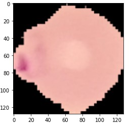
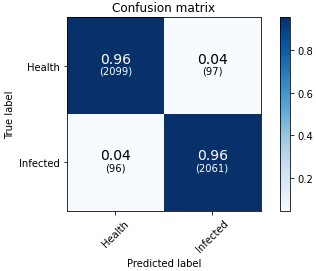

# This model can distinguish cell were infected by malaria or not
### Two kinds of traning data 
*RGB images

   

*Feature_extraxtion images

   
   
### The result of model evaluation (Confusion matrix)
   
